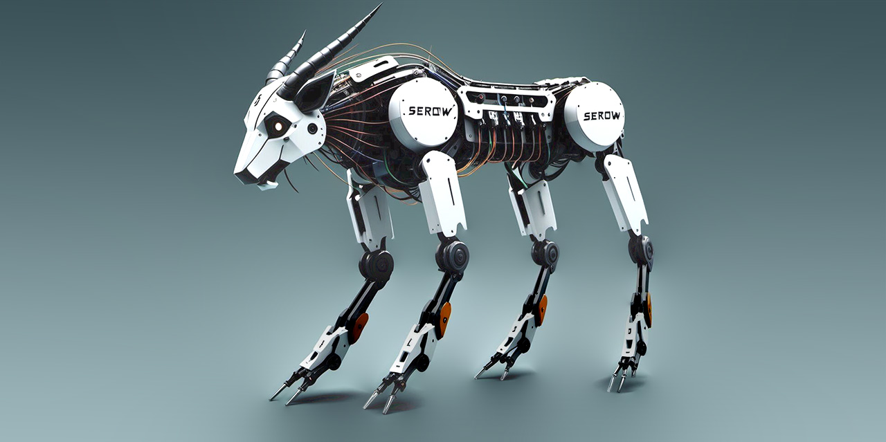
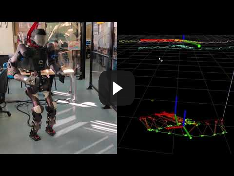
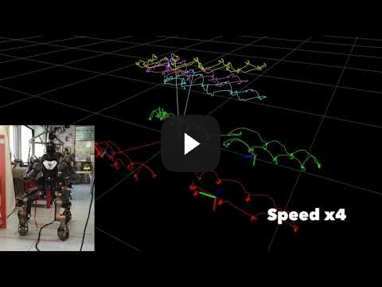

# README


SEROW (State Estimation RObot Walking) facilitates legged robot state estimation. Designed as a versatile tool, SEROW offers a generalized estimation solution applicable to legged robots with N limbs, accommodating both point and flat feet configurations. Notably, the framework's codebase is openly accessible under the GNU GPLv3 License.

# SEROW in Real-time
------------------------------------------------------------------ 

| Cogimon and SEROW  | Centauro and SEROW |
| ------------- | ------------- |
| [  ](https://www.youtube.com/watch?v=MLmfgADDjj0)  | [  ](https://www.youtube.com/watch?v=cVWS8oopr_M) |

------------------------------------------------------------------ 

Relevant Papers:
* Non-linear ZMP based State Estimation for Humanoid Robot Locomotion, https://ieeexplore.ieee.org/document/7803278 (Humanoids 2016 - nominated for the best interactive paper award)
* Nonlinear State Estimation for Humanoid Robot Walking, https://ieeexplore.ieee.org/document/8403285 (RA-L + IROS 2018)
* Outlier-Robust State Estimation for Humanoid Robots, https://ieeexplore.ieee.org/document/8968152 (IROS 2019)

More Videos: 
* https://www.youtube.com/watch?v=nkzqNhf3_F4
* https://www.youtube.com/watch?v=9OvIBg8tn54
* https://www.youtube.com/watch?v=ojogeY3xSsw

# Getting Started
These instructions will get you a copy of the project up and running on your local machine for testing purposes.

Define the environment variable inside your *.bashrc* file:
```
export SEROW_PATH=<path-to-serow-package>
```
## Prerequisites
* [Eigen](https://eigen.tuxfamily.org/dox/index.html) 3.4.0 and later
* [Pinocchio](https://github.com/stack-of-tasks/pinocchio) 2.2.1 and later
* [json](https://github.com/nlohmann/json/tree/master)
* cmake 3.16.3 and later
* gcc 9.4.0 and later
  
## Install
* `mkdir build && cd build`
* `cmake .. && make -j4`
* `sudo make install`  

## Test
* `cd test && mkdir build && cd build`
* `cmake .. && make -j4`
* `./nao_test`

## Citation
Upon usage in an academic work kindly cite: <br/>

@ARTICLE{PiperakisRAL18, <br/>
    author={S. {Piperakis} and M. {Koskinopoulou} and P. {Trahanias}}, <br/>
    journal={IEEE Robotics and Automation Letters}, <br/>
    title={{Nonlinear State Estimation for Humanoid Robot Walking}}, <br/>
    year={2018}, <br/>
    volume={3}, <br/>
    number={4}, <br/>
    pages={3347-3354}, <br/>
    doi={10.1109/LRA.2018.2852788}, <br/>
    month={Oct},<br/>
}<br/>

## License
[GNU GPLv3](LICENSE) 

