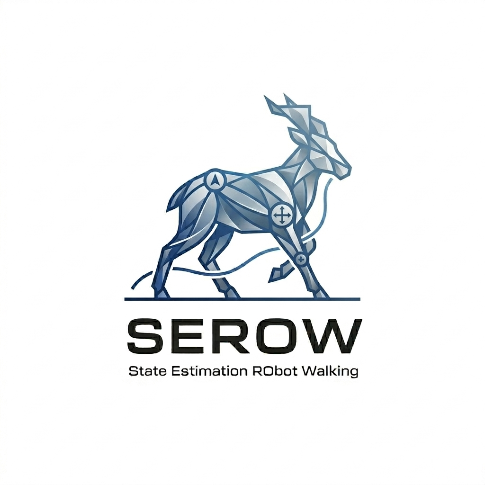
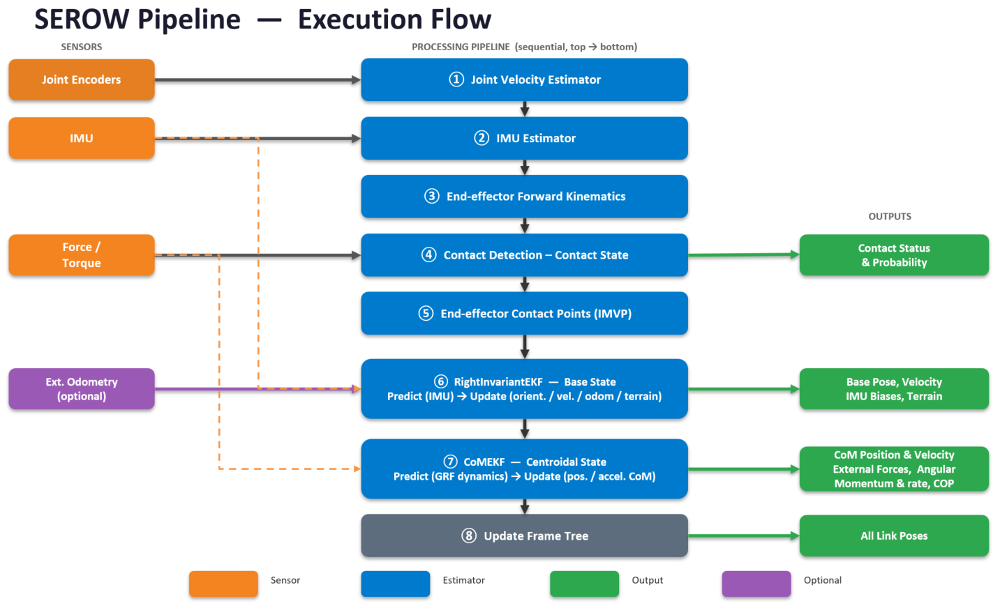
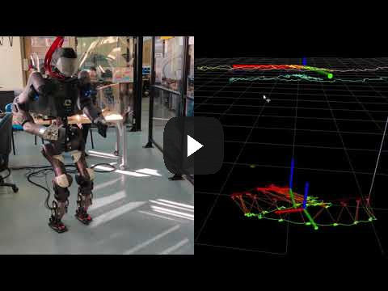
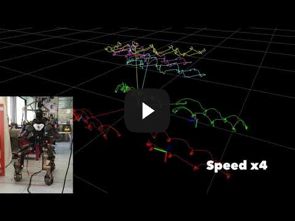

# README
## This repository is a work in progress.
We are actively developing and addressing issues with the estimation framework. Contributions, feedback, or suggestions are highly appreciated as we continue to enhance this project!



SEROW (State Estimation RObot Walking) facilitates legged robot state estimation. Designed as a versatile tool, SEROW offers a generalized estimation solution applicable to legged robots with N limbs, accommodating both point and flat feet configurations. Notably, the framework's codebase is openly accessible under the GNU GPLv3 License.


# What Problem Does SEROW Solve?

A legged robot (humanoid, quadruped, centaur) walks on the ground. Unlike a
wheeled robot that can use wheel encoders to know where it is, a legged robot's
feet repeatedly lift off and touch down. The robot needs to answer a few
fundamental questions in real-time:

  1. Where am I?              		(base position and orientation in the world)
  2. How fast am I moving?    		(base linear/angular velocity)
  3. Where is my Center of Mass (CoM)?  (critical for balance)
  4. How fast is my CoM moving? 	(critical for balance)
  5. Are there any external forces other than the Ground Reaction Forces (GRFs) acting on me? (critical for manipulation)

The robot's on-board sensors -- an IMU (accelerometer + gyroscope), joint
encoders, and foot force/torque sensors -- are all noisy and incomplete. No
single sensor can give the full answer. SEROW fuses all of them using principled probabilistic estimation to produce a coherent, real-time and low-drift state estimate.

# Sensor Inputs Explained

### IMU (Inertial Measurement Unit)
  - Mounted on the robot's torso ("base frame").
  - Measures linear acceleration (including gravity) and angular velocity.
  - Very fast (~100-2000 Hz) but drifts over time -- integrating acceleration to
    get velocity accumulates error quickly.
  - SEROW models and continuously estimates the gyroscope bias and accelerometer
    bias to compensate for drift.

### Joint Encoders
  - Each motor joint reports its angular position (radians).
  - Combined with a kinematic model (URDF/MJCF), informs where each foot is
    relative to the base frame.
  - Does NOT directly inform where the base is in the world.

### Force/Torque (F/T) Sensors -- Pressure Sensors 
  - Mounted at each foot (or ankle).
  - Measure the Ground Reaction Force (GRF) and optionally torque.
  - Used for two things:
    (a) detecting whether a foot is in contact with the ground, and
    (b) computing the Center of Pressure (COP).

### Optional: Exteroceptive Odometry
  - A camera-based (Visual Odometry) or LiDAR-based (LiDAR Odometry) system
    providing base position/orientation.
  - Used as an additional correction in the EKF if available.
  - Can be subject to outlier measurements in degraded environments. SEROW automatically accounts for that and rejects these outliers.

# High-Level Architecture

SEROW is structured as a pipeline of estimators that run sequentially each time
a new set of sensor readings arrives. 



# SEROW in Real-time

| Cogimon and SEROW  | Centauro and SEROW |
| ------------- | ------------- |
| [  ](https://www.youtube.com/watch?v=MLmfgADDjj0)  | [  ](https://www.youtube.com/watch?v=cVWS8oopr_M) |

------------------------------------------------------------------ 

### Relevant Papers:
* Non-linear ZMP based State Estimation for Humanoid Robot Locomotion, https://ieeexplore.ieee.org/document/7803278 (Humanoids 2016 - nominated for the best interactive paper award)
* Nonlinear State Estimation for Humanoid Robot Walking, https://ieeexplore.ieee.org/document/8403285 (RA-L + IROS 2018)
* Outlier-Robust State Estimation for Humanoid Robots, https://ieeexplore.ieee.org/document/8968152 (IROS 2019)

### More Videos: 
* https://www.youtube.com/watch?v=nkzqNhf3_F4
* https://www.youtube.com/watch?v=9OvIBg8tn54
* https://www.youtube.com/watch?v=ojogeY3xSsw

# Getting Started
These instructions will get you a copy of the project up and running on your local machine for testing purposes.

Define the environment variable inside your *.bashrc* file:
```
export SEROW_PATH=<path-to-serow-package>
```
## Prerequisites
* [Eigen](https://eigen.tuxfamily.org/dox/index.html) 3.4.0 and later
* [Pinocchio](https://github.com/stack-of-tasks/pinocchio) 3.0.0 and later
* [json](https://github.com/nlohmann/json/tree/master)
* [flatbuffers](https://github.com/google/flatbuffers)
* cmake 3.16.3 and later
* gcc 9.4.0 and later


## Install
* `mkdir build && cd build`
* `cmake .. && make -j4`
* `sudo make install`  

## Test
* `cd test && mkdir build && cd build`
* `cmake .. && make -j4`
* `./nao_test`

## Visualize data 
* Logs are saved under `/tmp` 
* Run [Foxglove](https://foxglove.dev/download)
* Load the data
* Import `foxglove_layout.json` 

## Citation
Upon usage in an academic work kindly cite: <br/>

@ARTICLE{PiperakisRAL18, <br/>
    author={S. {Piperakis} and M. {Koskinopoulou} and P. {Trahanias}}, <br/>
    journal={IEEE Robotics and Automation Letters}, <br/>
    title={{Nonlinear State Estimation for Humanoid Robot Walking}}, <br/>
    year={2018}, <br/>
    volume={3}, <br/>
    number={4}, <br/>
    pages={3347-3354}, <br/>
    doi={10.1109/LRA.2018.2852788}, <br/>
    month={Oct},<br/>
}<br/>

## License
[GNU GPLv3](LICENSE) 

