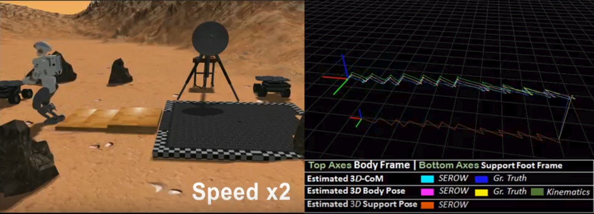

# Getting Started
These instructions will get you a copy of the project up and running on your local machine for testing purposes with ROS noetic.

## ROS noetic install
* `sudo apt-get install ros-noetic-pinocchio`
*  [json](https://github.com/nlohmann/json/tree/master)
* `git clone https://github.com/mrsp/serow.git`
* `catkin_make -DCMAKE_BUILD_TYPE=Release` 

## Minimum Robot Requirements
### Using the Base Estimator to estimate: 
* 3D-Base position/orientation/linear velocity
* 3D-Contact foot position/orientation
* IMU biases

### Requirements
* Robot state publisher (e.g. topic: `/joint_states`)
* IMU (e.g. topic `/imu0`)
* Feet Pressure or Force/Torque sensors for detecting contact (e.g. topic: `/left_leg/force_torque_states`, `/right_leg/force_torque_states`)

### Using the full cascade framework (Base Estimator + CoM Estimator) to estimate:
* 3D-Base position/orientation/linear velocity
* 3D-Contact foot position/orientation
* IMU biases
* 3D-CoM position/linear velocity
* 3D-External forces on CoM

### Requirements:
* Robot State Publisher (e.g. topic: `/joint_states`)
* IMU (e.g. topic `/imu0`)
* Feet Pressure or Force/Torque sensors for Center of Pressure (COP) computation in the local foot frame (e.g. topics `/left_leg/force_torque_states`, `/right_leg/force_torque_states`)

### Using our serow_utils package
Use the [serow_utils](https://github.com/mrsp/serow_utils) to visualize the estimated trajectories and to contrast them with other trajectories (e.g. ground_truth).

## ROS Examples
### Valkyrie SRCsim
* Download the valkyrie bag file from [valk_bagfile](http://users.ics.forth.gr/~spiperakis/valk.bag)
* `roscore`
* `rosbag play --pause valk.bag`
* `roslaunch serow serow_valkyrie.launch`
* `roslaunch serow_utils serow_utils.launch`
* hit space to unpause the rosbag play

### NAO Walking on rough terrain outdoors
* Download the nao bag file from [nao_bagfile](http://users.ics.forth.gr/~spiperakis/nao.bag)
* `roscore`
* `rosbag play --pause nao.bag`
* `roslaunch serow serow_nao.launch`
* `roslaunch serow_utils serow_utils.launch`
* hit space to unpause the rosbag play

### Launch on your Robot in real time
* Specify topics on `config/estimation_params.yaml`
* `roslaunch serow serow.launch`

## Citation
Upon usage in an academic work kindly cite:  

@ARTICLE{PiperakisRAL18,  
    author={S. {Piperakis} and M. {Koskinopoulou} and P. {Trahanias}},  
    journal={IEEE Robotics and Automation Letters},  
    title={{Nonlinear State Estimation for Humanoid Robot Walking}},  
    year={2018},  
    volume={3},  
    number={4},  
    pages={3347-3354},  
    doi={10.1109/LRA.2018.2852788},  
    month={Oct}, 
} 

## License
[GNU GPLv3](LICENSE) 
