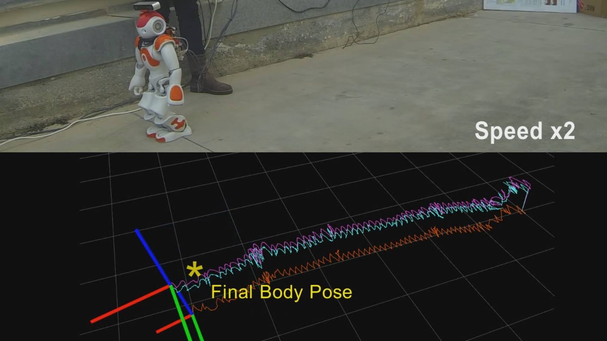

# Getting Started
These instructions will get you a copy of the project up and running on your local machine for testing purposes with ROS noetic.

## Install
* Install [SEROW](https://github.com/mrsp/serow/tree/devel?tab=readme-ov-file#getting-started)
* Create a ROS workspace with `mkdir -p ros_ws/src`
* `cd ros_ws/src`
* `ln -s $SEROW_PATH/serow_ros ./serow_ros`
* `cd .. && catkin_make -DCMAKE_BUILD_TYPE=Release` 

## Minimum Robot Requirements
### Using the Base Estimator to estimate: 
* 3D-Base position/orientation/linear velocity
* 3D-Contact foot position/orientation
* IMU biases

### Requirements
* Robot state publisher (e.g. topic: `/joint_states`)
* IMU (e.g. topic `/imu0`)
* Feet Pressure or Force/Torque sensors for detecting contact (e.g. topic: `/left_leg/force_torque_states`, `/right_leg/force_torque_states`)

### Using the full cascade framework (Base Estimator + CoM Estimator) to estimate:
* 3D-Base position/orientation/linear velocity
* 3D-Contact foot position/orientation
* IMU biases
* 3D-CoM position/linear velocity
* 3D-External forces on CoM

### Requirements:
* Robot State Publisher (e.g. topic: `/joint_states`)
* IMU (e.g. topic `/imu0`)
* Feet Pressure or Force/Torque sensors for Center of Pressure (COP) computation in the local foot frame (e.g. topics `/left_leg/force_torque_states`, `/right_leg/force_torque_states`)

## ROS Examples
### Valkyrie SRCsim
* Download the valkyrie bag file from [valk_bagfile](https://drive.google.com/file/d/19Q0m3dUCS2Il-SP_xgqSF4WQosfykrul/view?usp=sharing)
* `roscore`
* `rosbag play --pause valk.bag`
* `roslaunch serow_ros serow_valk.launch`
* hit space to unpause the rosbag play

### NAO walking on rough terrain outdoors
* Download the nao bag file from [nao_bagfile](https://drive.google.com/file/d/1DAimsvSaths10C3lDGTYhwei64Ih1Ffx/view?usp=sharing)
* `roscore`
* `rosbag play --pause nao.bag`
* `roslaunch serow_ros serow_nao.launch`
* hit space to unpause the rosbag play

## License
[GNU GPLv3](LICENSE) 
